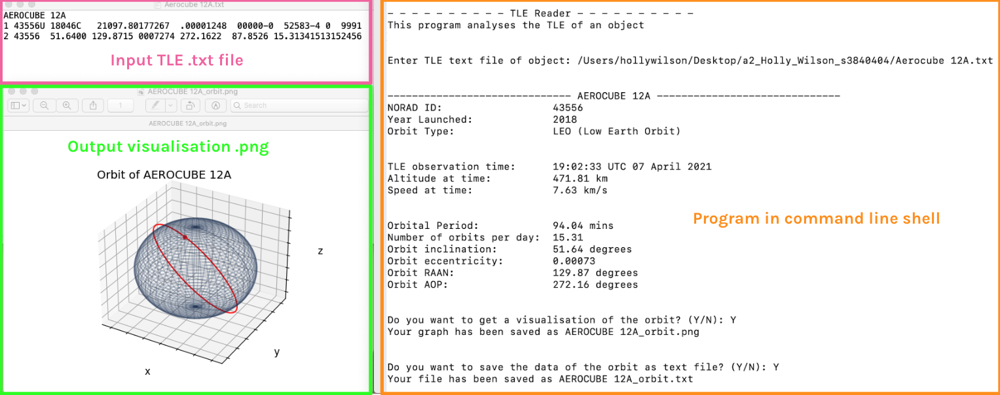

# TLE Reader

A simple program that interprets satellite TLE .txt files and creates visualisations.

## Table of contents
* [Author's Comments](#author's-comments)
* [General Info](#general-info)
* [Technologies](#technologies)
* [Setup](#setup)
* [Import TLE files](#import-tle-files)
* [Exports](#exports)

## Author's Comments
Dear all, this is my first project I have uploaded on github :). I created this in project in 2021, and have decided to try github out so that is why it only going up now (2023). I am a beginner-novice programmer, so I would greatly appreciate any feedback, be that regarding the program or my use of github, and I will try to implement it. I hope that you will enjoy using this novel program. Have fun! - Holhen

## General Info
The program converts the standard TLE file format https://en.wikipedia.org/wiki/Two-line_element_set to a more readable and informative format.\
Includes additional info including orbit type, altitude, speed, orbital period, orbits per day, using orbital calculations.\
It can also create a visualisation of the orbit.

## Technologies
Project is created with python 3.

## Setup
To run this project, download the TLEreader.py file. Make sure TLE .txt file in on same path level as the TLEraeder.py file. Open the command line shell.\
Either:\
a) type pyhton3 followed by the file path of the TLEreader.py file \
b) Change directory to the folder containing both TLEreader.py. Type "python3 TLEreader.py", the program will begin.

## Import TLE Files
Takes input txt file of a satellite TLE (can be downloaded from Celestrak https://celestrak.org/NORAD/elements/).\
Two sample TLE files are provided (Aerocube 12A.txt and Intelsat 5.txt), these can be found in the "TLE import files provided" folder

## Exports
A visualisation and data can be downloaded as part of the program.\
Theses will save as a .png file, and .txt file respectivley and will be saved in the same location as the other input file.\
For an input file called sat.txt, the exports will be saved as sat.png and sat_orbit.txt\
(Note: if the directory was not changed in the program [setup](#setup), the export files will be saved in the default file directory.)

